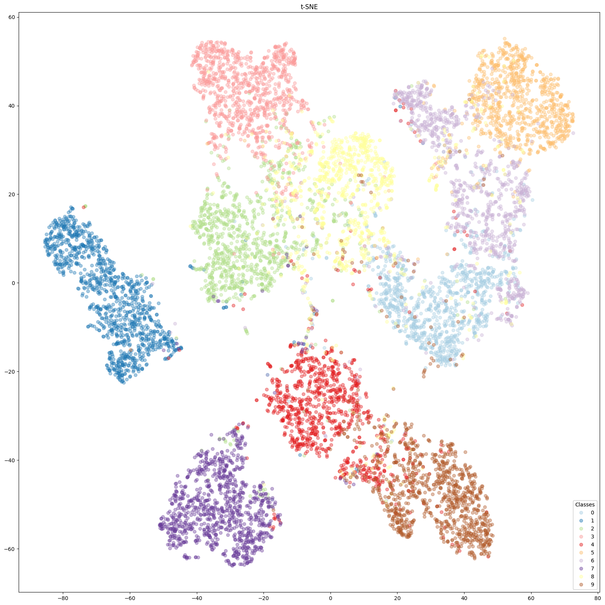

# tsne
t-distributed stochastic neighbor embedding (t-SNE) is a statistical method for visualizing high-dimensional data by giving each datapoint a location in a two or three-dimensional map.
  

# Arguments
## tsne
  |        name       |type |       available values        |                     help                      |
  |:-----------------:|:---:|:-----------------------------:|:----------------------------------------------|
  |       gpu-id      | str |range(0,the max number of gpus)|               gpu number to use               |
  |     batch_size    | int |               -               |      batch size for training the model        |
  |       model       | str |         res18, vgg16         |           architecture for training           |
  |     data    | str |           -              |       the name of in-distribution data        |
  |     output_folder     | str |               -               |   directory where the model is located and results will be saved   |
  |     best_epoch     |int|               -               |                best epoch                |


# RUN
```
## Examples
python tsne.py --model res18 --data mnist --batch_size 128 --output_folfder ./output/ --gpu-id 0
```