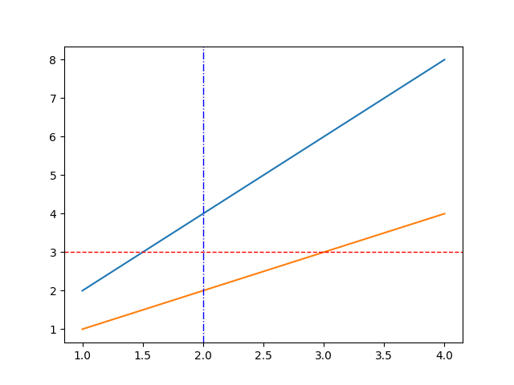
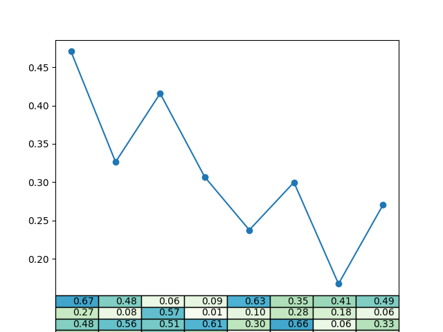
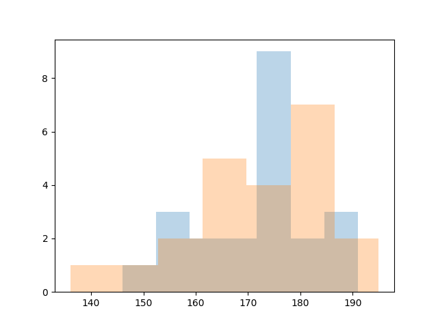
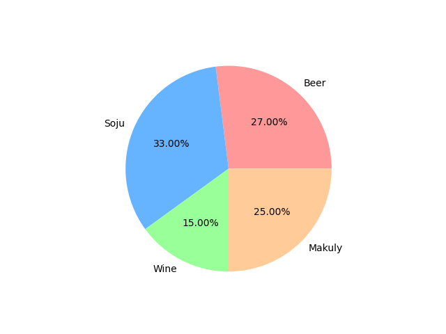

# Data Visualization
파이썬에서 주로 활용되는 시각화 라이브러리 matplotlib를 이용하여 데이터 시각화를 하고 유용한 함수들에 대해 소개함

# Install
```
pip install matplotlib
```

# anatomy of figure
그림의 각 명칭도  


# draw plot
https://matplotlib.org/stable/api/_as_gen/matplotlib.pyplot.plot.html  
plot 그리기  

```
import matplotlib.pyplot as plt

plt.plot([1,2,3,4], [2,4,6,8])
plt.plot([1,2,3,4], [1,2,3,4])
plt.show()
```
plot 함수에 두 개의 리스트를 입력하면 각 x축, y축 값으로 지정됨  
plot 함수를 여러개 사용한다면 여러개의 plot을 그릴 수 있음

## xlabel, ylabel
```
plt.xlabel('X-Label')
plt.ylabel('Y-Label')
```
x축과 y축의 이름을 지정하기

## color&style
  
선의 색깔 및 스타일 변경  
```
plt.plot([1,2,3,4], [2,4,6,8], 'r--')
plt.plot([1,2,3,4], [1,2,3,4], 'm-.')
```
plot함수 내에 색깔 및 스타일에 대한 값을 입력하면 변경 가능  
자세한 사항은 아래 그림 참조  
  
  

## grid
격자 그리기  

```
plt.plot([1,2,3,4], [2,4,6,8])
plt.plot([1,2,3,4], [1,2,3,4])
plt.grid(True)
```

## hlines&vlines
그래프 내에 수직 및 수평선 추가  

```
plt.plot([1,2,3,4], [2,4,6,8])
plt.plot([1,2,3,4], [1,2,3,4])
plt.axhline(y=3, color='r', linestyle='--',  linewidth=1)
plt.axvline(x=2, color='b', linestyle='-.',  linewidth=1)
```

## table
https://matplotlib.org/stable/api/_as_gen/matplotlib.pyplot.table.html  
테이블 추가  

```
import numpy as np
x = np.random.rand(5, 8)*.7 
plt.plot(x.mean(axis=0), '-o', label='average per column')
plt.xticks([])
plt.table(cellText=[['%1.2f' % xxx for xxx in xx] for xx in x],cellColours=plt.cm.GnBu(x),loc='bottom') # loc는 table위치
```

## function
그 외 유용한 함수 소개  

그래프 크기 조절
```
plt.figure(figsize=(n,m))
```

그래프 저장하기
```
plt.savefig('root', dpi=300) # dpi는 사진의 해상도
```

범례 표시하기  

```
plt.plot([1,2,3,4], [2,4,6,8])
plt.plot([1,2,3,4], [1,2,3,4])
plt.legend(['A', 'B'])
```

그래프 타이틀 지정하기
```
plt.title('graph title', fontsize=22)
```

x축, y축 폰트 회전 및 크기 설정
```
plt.xaxis(rotation = 30, fontsize = '12')
plt.yaxis(rotation = 45, fontsize = '14')
```


# draw bar graph
https://matplotlib.org/stable/api/_as_gen/matplotlib.pyplot.bar.html  
막대 그래프 그리기  

```
x = [0,1,2]
years = ['2020', '2021', '2022']
prices = [500, 450, 700]

plt.bar(x, prices)
plt.xticks(x, years)
```

# draw barh graph
https://matplotlib.org/3.1.1/api/_as_gen/matplotlib.pyplot.barh.html  
수평 막대 그래프 그리기  

```
x = [0,1,2]
years = ['2020', '2021', '2022']
prices = [500, 450, 700]

plt.barh(x, prices, tick_label=years)
```

# draw scatter plot
https://matplotlib.org/stable/api/_as_gen/matplotlib.pyplot.scatter.html  
산점도 그리기  

```
import numpy as np
N = 30
x = np.random.rand(N)
y = np.random.rand(N)
colors = np.random.rand(N)
size = (100 * np.random.rand(N))
plt.scatter(x, y, s=size, c=colors, alpha=0.5) # s는 각 산점도의 크기, c는 각 산점도의 색깔, alpha는 산점도의 투명도를 나타냄
```

# draw historgram
https://matplotlib.org/stable/api/_as_gen/matplotlib.pyplot.hist.html  
히스토그램 그리기  

```
height = [170, 165, 174, 176, 173, 167, 185, 184, 183, 174, 191, 164, 153, 153, 175, 175, 178, 156, 146, 185, 175, 177]
plt.hist(height, alpha=0.5) # alpha는 투명도를 나타냄
```

## histograms
  
```
height1 = [170, 165, 174, 176, 173, 167, 185, 184, 183, 174, 191, 164, 153, 153, 175, 175, 178, 156, 146, 185, 175, 177]
height2 = [175, 145, 164, 136, 183, 163, 165, 178, 165, 156, 195, 184, 186, 182, 175, 184, 193, 164, 159, 173, 181, 184]
# weight = [68, 81, 64, 56, 78, 74, 61, 77, 66, 68, 59, 71, 80, 59, 67, 81, 69, 73, 69, 74, 70, 65]

plt.hist(height1, bins=7, alpha=0.3)
plt.hist(height2, bins=7, alpha=0.3)
```
## function
히스토그램의 스타일  
```
plt.hist(height, histtype='step')
plt.hist(height, histtype='stepfilled')
```

# draw pie chart
https://matplotlib.org/stable/api/_as_gen/matplotlib.pyplot.pie.html  
원그래프 그리기  

```
ratio = [27, 33, 15, 25]
labels = ['Beer', 'Soju', 'Wine', 'Makuly']
plt.pie(ratio, labels=labels, autopct='%.2f%%') # autopc는 숫자 표현 형식으로 소숫점 아래 두 자리 까지 표현함
```
## function
색 바꾸기  

```
colors = ['#ff9999','#66b3ff','#99ff99','#ffcc99']
plt.pie(ratio, labels=labels, autopct='%.2f%%', colors=colors)
```
도넛 형태로 그리기  

```
labels = ['Beer', 'Soju', 'Wine', 'Makuly']
sizes = [27, 33, 15, 25]
colors = ['#ff9999','#66b3ff','#99ff99','#ffcc99']
 
fig1, ax1 = plt.subplots()
ax1.pie(sizes, colors = colors, labels=labels, autopct='%1.1f%%')
centre_circle = plt.Circle((0,0),0.70,fc='white') # 중앙 원 그리기
fig = plt.gcf()
fig.gca().add_artist(centre_circle)
ax1.axis('equal')  
plt.tight_layout()
```